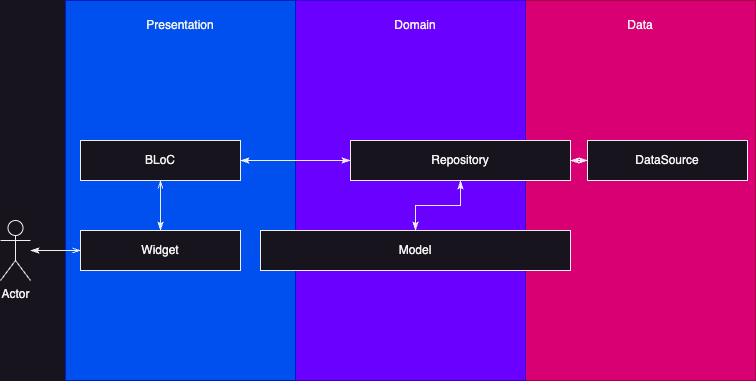

## Layers:

### 1. Presentation (Презентаційний шар)
Відповідає за взаємодію логіки та даних із користувачем. Тут розміщується вся логіка, пов'язана з UI, наприклад, віджети, екрани та користувацькі інтерфейси.

### 2. Domain (Доменний шар)
Визначає **що** має відбуватися в додатку. Містить абстракції та моделі, які описують бізнес-логіку додатку.

### 3. Data (Шар даних)
Відповідає за **як** це відбувається. Тут розміщені конкретні реалізації, які працюють із зовнішніми джерелами даних (наприклад, API, бази даних).

*Картинка для привернення уваги*

---

## Фічі (Features)
Зазвичай кожна сторінка є окремою фічею: **1 екран = 1 фіча**. Фічі можуть вбудовуватися одна в одну, але важливо, щоб не було залежностей від шарів інших фіч, за винятком **shared**.

Наприклад:
- Окрема сторінка.
- Група сторінок.
- Окремий віджет.

## Shared
Фактично, **shared** — це одна велика "фіча", винесена окремо для зручності.

Зазвичай містить:
- Спільні віджети (наприклад, кнопки).
- Спільні моделі (наприклад, модель користувача).
- Утиліти та допоміжні функції.
- Тощо...

---

## Repository (Репозиторій)
Репозиторій забезпечує доступ до даних та їх обробку. Оскільки в проєкті відсутні use-cases, репозиторії безпосередньо обробляють дані.

Чому потрібна абстракція в **domain**?
- Можливість підміни реалізацій.
- Тестованість.
- Тощо...

Приклад: створюємо репозиторій, який повертає мок-дані, поки немає бекенду.

Репозиторій може належати конкретній фічі або бути спільним (shared) для всього додатку:
- **/shared/domain/repository** — абстрактна частина репозиторію.
- **/shared/data/repository** — реалізації репозиторіїв. Можна всі репозиторії сюди складати і використовувати по додатку, а можна взагалі по одному для кожного джерела даних, та й все.

---

## DataSource
DataSource працює з конкретним джерелом даних. Приклад: **FirebaseFirestore** сам по собі є data source, і для нього можна не створювати додаткову обгортку, хоча це бажано.

DataSource зазвичай є проміжним шаром для отримання даних та містить мінімум логіки.

DataSource може бути як фічею, так і спільним (shared) для всього додатку:
- **/shared/data/datasource** — Можна всі датасорси сюди складати і використовувати по додатку, а можна взагалі по одному для кожного джерела даних зробити, та й все.

---

## Model (Моделі)
Моделі описують структури даних, які використовуються в додатку або конкретній фічі. Також оскільки ми не використовуємо DTO, сюди входять мапери для перетворення даних у різні формати.

Приклади маперів:
- **fromNetwork / toNetwork** — зазвичай для REST API.
- **fromDocument / toDocument** — для роботи з Firebase.
- **fromDB / toDB** — для роботи з локальною базою даних.
- **fromMap / toMap** — Загальний маппер для якихось неочікуваних випадків, наприклад, для швидкого збереження в преференсах/пам'яті (той самий hydratedBLoC).

Моделі можуть належати конкретній фічі або бути спільними для всього додатку:
- **/shared/domain/models** — Можна взагалі всі моделі сюди складати і використовувати по додатку.

---

## Додаткова інформація:
- Можна все складати в shared, окрім екранів, з яких робити фічі. Потім це все можна (якщо потрібно) спокійно відрефакторити.
- Усі залежності в шарах **data** та **domain** мають бути явними та передаватися через конструктори.
